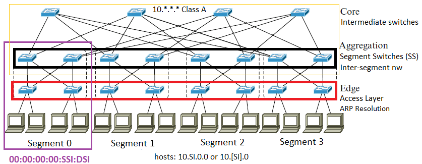
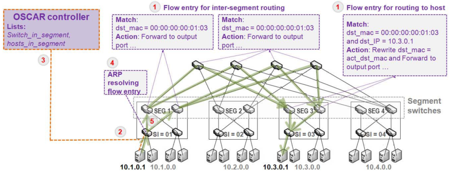
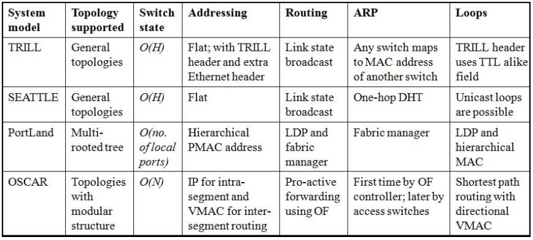
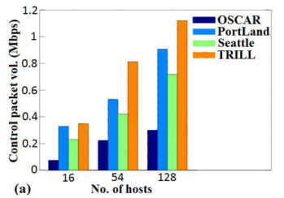
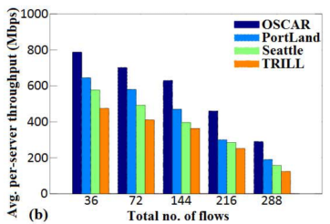
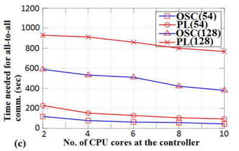
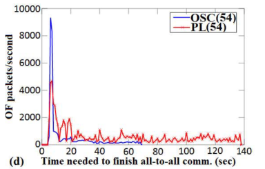
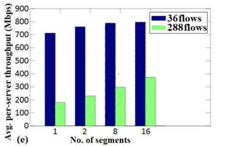

```{r setup, include=FALSE}
knitr::opts_chunk$set(echo = FALSE)
```

# Introduction

## DCN Fabric

A system of switches and servers and the interconnections between them that can be represented as a fabric.

## OpenFlow

1. Is a Software Defined Network(SDN) API.
1. Provides central programmable control and management of network.
    - Proactive or reactive control.
    - OF Controller.
    - Control traffic overhead for large networks.
    
Perform L2 and L3 forwarding by installing policies on the DCN switches.

----

### SEATTLE

Ethernet compatible plug-and-play DCN fabric.

1. Problems with scalability to maintain switch states when number of hosts grow.

----

### PortLand

L2 fabric which enables scalable routing with a virtual L2 addressing.

1. Performs ARP resolution (location based Pseudo MAC).
1. Uses location discovery protocol (LDP).
1. **Limitated** only to multi-rooted hierarchical tree topology.

----

### IETF TRILL

Performs L2 bridging and multipath using RBridges.

1. Switches learn the topology and discovers host by broadcasting local information.
1. Several DNC fabrics use TRILL to deal with scalability.

## OSCAR

A OF based DCN fabric that uses a combination of virtual modular L2 addressing and L3 addressing to enable scalable routing in the DCN.

# Proposed Model

## Topologies

OSCAR can be deployed in almost any switch-centric DCN topology.

1. Tree based topologies.
1. Recursive topologies.
1. Container based modular data center topologies.

----

### Data center topologies

![A taxonomy of data center topologies.$[7]$](topology.PNG)

----

### Fattree topology

**Constraints**$[7]$

1. Each $n$-port switch in edge tier is connected to $\frac{n}{2}$ servers.
1. Remaining $\frac{n}{2}$ ports are connected to $\frac{n}{2}$ switches in aggregation level.
1. Basic cell: *pod*
    - $\frac{n}{2}$ aggregation level switches.
    - $\frac{n}{2}$ edge-level switches.
    - Servers connected to edges.
1. Maximum number of hosts is $\frac{n^3}{4}$

----

### Fattree topology

**Example**

![A 3-level fat-tree topology with 4-port switches.$[7]$](fattree.PNG)

## Structure

### OSCAR terminology



## Functionality

### Major operations



----

### Network Discovery by the Controller

1. Discovery of switches and links using LLDP.
1. OF Switches identified by 64 bit Data Path Ids (dpid).
    - Broadcast msgs: dpid, ports.
1. Applying LLDP periodically in case of failures.

----

### Network Information Maintained in the OF Controller

1. switch-in-segment(SI).
    - One time manual effort by the network administrator.
    - General control over the network in case of problems.
1. hosts(dpid) = dpid, host-IP, host-MAC per switch.
1. hosts-in-segment(SI) = SI, ip-prefix, host-IP, host-MAC.

OSCAR requires manual configuration only during initial setup.

----

### Loop-Free Forwarding

1. Equal weigth shortest paths from an SS to another SS with Dijkstra.
1. Flows entries matches with VMAC.
    - 00:00:00:00:SI1:SI2 and 00:00:00:00:SI2:SI1 are two different flows.
1. Avoids forwarding loops giving directional VMAC in inter-segment routing.

----

### Proactive Flow Installation for Forwarding

1. After paths are computed, all switches have matching rules between SSes.
1. Matching rules are installed for all possible paths.
1. Inter-segment routing rules are installed once.

----

### ARP Resolution

1. One-hop switch intercepts and sends to controller.
1. Controller looks at host-in-segment(SI) to determine SSI and DSI.
1. Returns VMAC (pair SSI, DSI).

----

### VM Migration

1. Migration within segment:
    - Update output port in L3 forwarding.
1. Migration to another segment:
    - Update controllers host-in-segment(SI).
    - Update flow tables.

# A comparison with other DCN fabrics

## Switch state complexity

1. TRILL and Seattle: all hosts forwards to every host.
    - TRILL uses less entries.
    - Order O(H) with H number of hosts.
1. PortLand: Hierarchichal PMAC -> O(Number of local ports)
1. $N + (H/N) + k_3 +1)$ with:
    - $N$ number of switches.
    - $H$ number of hosts.
    - What we can do with $H$ and $N$? O(N)

## General comparison

### Table comparing another DCN fabrics.



# Performance evaluation

## What are we evaluating?

The performance of OSCAR is evaluated in terms of **scalability** of the OF based fabric manager.

> Control traffic volume

> Throughput

## Conditions

1. Prototypes of TRILL, SEATLE and PortLand.
1. All using a *fattree* topology.
    - 16, 54 and 128 hosts.
1. Floodlight OF controller for fabric manager modules.
1. Mininet 2.1.1 to create the test environments.
1. All links in the network at 1Gbps capacity.
1. Results are averaged over 20 runs for each experiment.

----

### Floodlight controller

> Model 
  
  IBM Server x3500 M4

> Processor

  Intel(R) Xeon(R) CPU E5-2620 2.00GHz processor.

> Other characteristics

1. Ubuntu 14.04 VM.
1. 3584 MB RAM
1. Maximum 10 cores available.

----

### Mininet 2.1.1

> Model 
  
  Desktop PC.

> Processor

  Intel i7 3.40GHz processor.

> Other characteristics

1. Ubuntu 14.04 VM.
1. 10 GB RAM
1. 4 CPU cores available.

## Volume of control packets

 

----

### Which packets?

1. OF packets.
1. Control packets such as LLDP, ARP, DHCP.
1. Link state advertisement during sequential all-to-all ICMP.

### Explanation

1. TRILL and SEATTLE use broadcast of link state.
    - SEATTLE unicast of control messages.
    - Consistent hashing.
1. PortLand needs ARP resolution.
1. How OSCAR manages this problems?
    - Proactive flow installation.
    - Unicast of ARP packets.

## Average per server throughput

 

----

### Rules of the game

1. all-to-all segment-to-segment TCP traffic.
1. DCN with 8 segments.
1. $n$ number of hosts in each segment.
      - $n \in \left\{1,2,4,6,8\right\}$
1. Flows generated using DITG.

### Possible explanation

$36 = {{9}\choose{2}} = \frac{9!}{2!7!} = \frac{9*7}{2}$

1. Author assumes possibly 9 segments instead of 8.
1. According to explanation should be $s-1$ * $n$.
    - "The traffic is created with $n$ number of hosts in each segment sending flows (...) to $n$ other hosts in each of the other segments"

## Time to complete communication

 

## OF packet rate against timeline

 

## Throughtput in OSCAR

 

----

### Why increasing segments helps throughput? 

1. Inter-segment paths.
1. Using 128 hosts.

# Conclusion

## Problems

1. Manual configuration of DCN switches.
1. Large control packet trafic. (ARP packet traffic).
1. Resetting of TCP connections due to VM migration.
1. Scalability of OF for centralized dynamic routing.

## OSCAR and DCN brief recap

1. Scheme of combination or Virtual MAC based L2 and L3 addressing.
1. Use of modular VMAC minimizes the number of forwarding entries.
1. As the size of DCN grows the centralized control of OF becomes a bottleneck.


## OSCAR achieves

1. Reduces overall traffic with a proactive approach.
1. Loop-free forwarding.
1. Low routing delay.
1. Higher throughtput.
1. Seemless VM migration.
1. Smaller flow tables at switches.

# Comments

## On definition

### A routing strategy

"We propose **an OpenFlow (OF)-based SCAlable Routing strategy** (OSCAR) for modular data center networks (DCN) using hybrid addressing".

### A DCN fabric

"We propose **an OF based DCN fabric** named OSCAR (OpenFlow based SCAlable Routing) that uses a com- bination of virtual modular L2 addressing and L3 addressing to enable scalable routing in the DCN"

### An OF based scalable routing scheme

"(...) **An OF based scalable routing scheme** named OSCAR has been proposed for DCNs with modular structure".

## On optimization terminology

### In abstract

"The control traffic is **minimized** to achieve high scalability and flexibility in DCN routing"

### In comparison (optimized) 

"OSCAR achieves flexibility in topologies supported, **optimization** in switch state, reduction in ARP packet traffic and loop freedom."

### In conclusion

"Use of modular VMAC **minimizes the number** of forwarding entries."

## On experiments

1. No mention of standard deviation of results. 
1. No explanation of value 20 for experiments.
1. No explanation of limitating examples on graphics 3 and 4.
1. No negative results?
